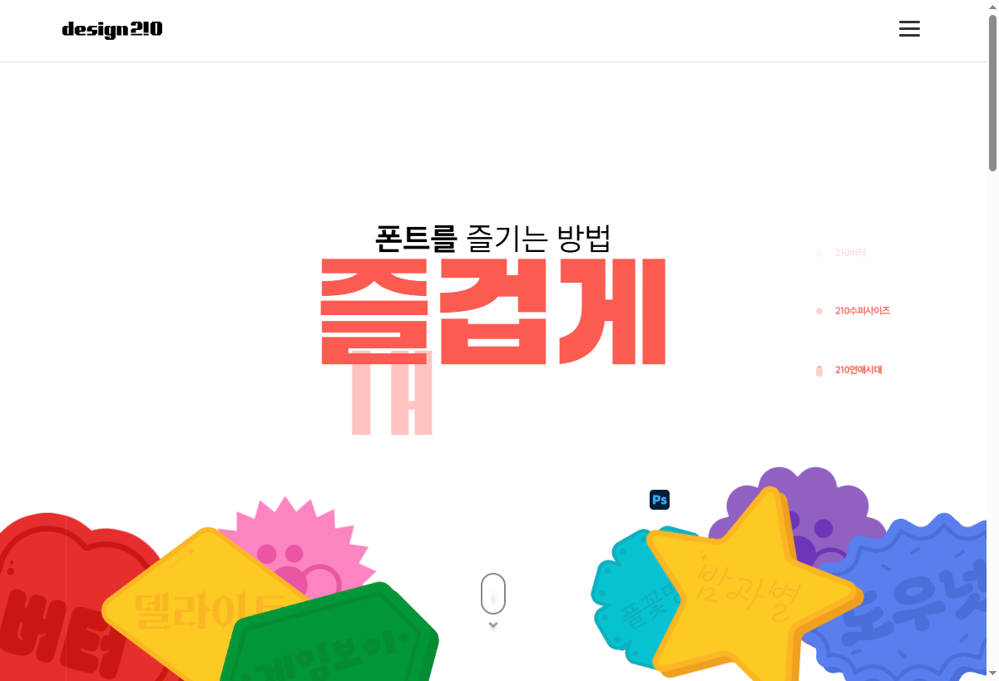
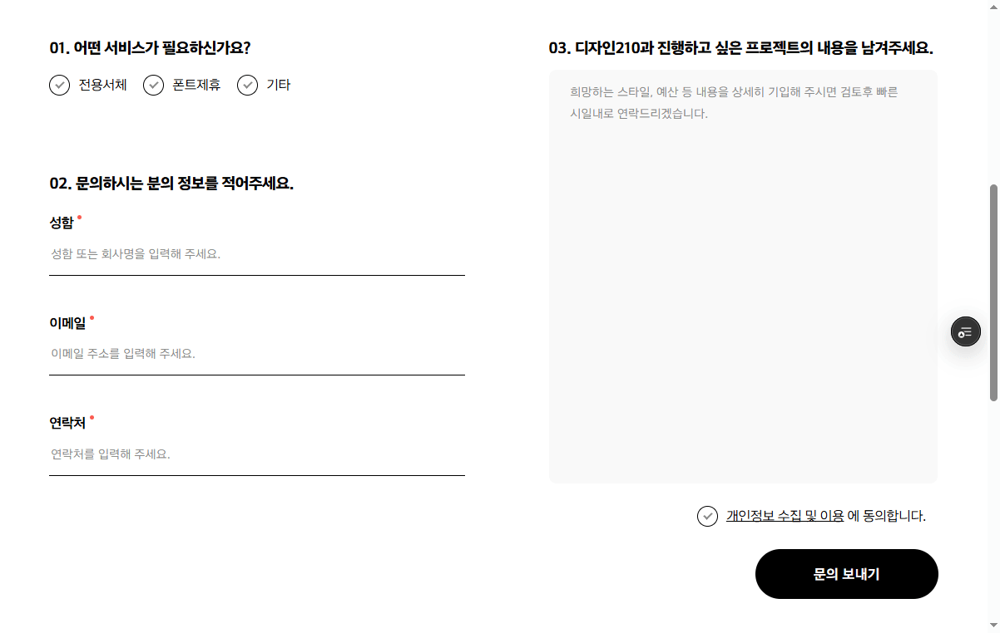

# 브랜드 사이트 구축 프로젝트

🔗 **[Live Demo](https://portfolio-p04-pub.vercel.app/index.html)**
> 내부 사정으로 중단된 프로젝트이나, 개인 포트폴리오 목적으로 재구성하였습니다.

브랜드 아이덴티티를 반영한 공식 웹사이트의 디자인 및 구현을 진행했습니다.
GSAP(ScrollTrigger)를 활용해 스크롤 기반 인터랙션을 구현하고, 심플하면서도 캐주얼한 브랜드 무드를 반영했습니다.
SCSS를 활용해 스타일을 체계적으로 구조화하여 재사용성과 유지보수성을 고려한 스타일 시스템을 구축했습니다.

## 프로젝트 상세내용

- **기간** : 2024.06 ~ 2024.10 (약 5개월)
- **인원** : 3명 (디자이너 2명 · 퍼블리셔 1명)
- **역할** : 기획·디자인 참여, 퍼블리싱 전담

| 영역         | 기여도 |
|--------------|--------|
| 기획 & 디자인 |   60%  |
| 퍼블리싱      |  100%  |

## 사용 기술

- **디자인** : Photoshop · Illustrator · Figma 
- **개발** : HTML · SCSS · JavaScript · jQuery · GSAP


## 주요 인터랙션

- 브랜드의 슬로건을 Swiper 슬라이드와 애니메이션을 활용해 생동감 있게 표현했습니다.
- 하단 스티커들은 마우스로 드래그할 수 있게 했으며, 드래그를 놓으면 원래 자리로 튕기듯 복귀하도록 GSAP Draggable로 구현했습니다.

- 스크롤 위치에 따라 퀵메뉴를 노출하고, 하단 도달 시에는 position을 `fixed → absolute`로 전환해 푸터를 덮지 않도록 했습니다.
- 각 페이지에서 GSAP ScrollTrigger로 요소가 뷰포트에 들어올 때 자연스럽게 등장하도록 처리했습니다.

- 입력값을 검사해 빈 칸 또는 형식 오류가 있을 경우 해당 칸 아래에 안내 문구를 띄우고, 제출을 막았습니다.

## SCSS 아키텍처

스타일 코드의 유지보수성과 재사용성을 높이기 위해 역할에 따라 디렉토리를 분리했으며, 변수와 믹스인 중앙 관리로 일관된 디자인 시스템을 구현했습니다.

```
scss/
├── config/          ← 전역 설정
│   ├── _reset.scss        리셋
│   ├── _base.scss         기본 태그 스타일
│   ├── _typography.scss   폰트/텍스트
│   └── _keyframes.scss    애니메이션 키프레임
│
├── helpers/         ← 유틸리티
│   ├── _variable.scss     색상·사이즈 변수
│   ├── _mixins.scss       재사용 믹스인
│   ├── _flex.scss         플렉스 유틸
│   └── _meidaQuery.scss   반응형 브레이크포인트
│
├── layout/          ← 공통 레이아웃
│   ├── _header.scss
│   ├── _footer.scss
│   └── _quickmenu.scss
│
├── components/      ← 재사용 컴포넌트
│   ├── _button.scss
│   ├── _modal.scss
│   ├── _form.scss
│   └── ...
│
└── pages/           ← 페이지별 스타일
    ├── main/
    ├── company/
    └── ...
```

### 변수 · 타이포그래피 시스템

```scss
/* helpers/_variable.scss */
$fontDef:     "wf210마루고딕040";  // 본문 기본
$fontTitle:   "wf210마루고딕030";  // 제목 (가는 느낌)
$fontBold:    "wf210마루고딕070";  // 강조
$fontBoldEx:  "wf210마루고딕090";  // 최대 강조

:root {
  --color-point: #fb5a50;
  ....
}
$colorPo01: var(--color-point);
$colorDef:  var(--color-def);
$colorGray: var(--color-gray);
```

### ellipsis 믹스인

```scss
/* helpers/_mixins.scss 에서 정의 */
@mixin ellipsis($lines: 1) {
    @if ($lines == 1) {
        overflow: hidden;
        text-overflow: ellipsis;
        white-space: nowrap;
    } @else {
        display: -webkit-box;
        -webkit-line-clamp: $lines;     // 멀티라인 지정
        -webkit-box-orient: vertical;
        overflow: hidden;
    }
}

/* 사용 예시 */
.title   { @include ellipsis; }      // 1줄 말줄임
.desc    { @include ellipsis(2); }   // 2줄 말줄임
.content { @include ellipsis(3); }   // 3줄 말줄임
```

### keyframes 믹스인

```scss
/* helpers/_mixins.scss 에서 정의 */
@mixin keyframes($animation-name) {
    @-webkit-keyframes #{$animation-name} { @content; }  // Safari
    @-moz-keyframes     #{$animation-name} { @content; }  // Firefox
    @keyframes          #{$animation-name} { @content; }  // 표준
}

/* 사용 예시 - 스크롤 다운 애니메이션 */
@include keyframes(scrolldown-wheel) {
    0%   { opacity: 0; height: 6px; }
    40%  { opacity: 1; height: 10px; }
    80%  { @include translate(0, 20px); opacity: 0; }
    100% { height: 3px; opacity: 0; }
}
```

### icon 함수 - 컬러 변형 가능한 인라인 SVG 아이콘

```scss
/* helpers/_icons.scss 에서 정의 */
// SVG를 data-URI로 변환해 별도 이미지 파일 없이 컬러별 아이콘을 생성
@function icon($icon-name, $color, $color2: "") {
    $icons: (
        arrow-right: '<svg xmlns="..." viewBox="0 0 512 512">
            <path fill="%23#{$color}" d="..."/></svg>',
        // shop, news, document, arrow-left, arrow-top, link, download 등
    );
    $icon: _buildIcon(map-get($icons, $icon-name));
    @return url("data:image/svg+xml;utf8,#{$icon}");
}

/* 사용 예시 — 색상 값만 바꿔서 같은 아이콘의 컬러 변형 생성 */
.ic_arrow_right {
    &.point { background-image: icon(arrow-right, "FB5A50"); }
    &.white { background-image: icon(arrow-right, "fff"); }
    &.black { background-image: icon(arrow-right, "1c1c1c"); }
}
```
